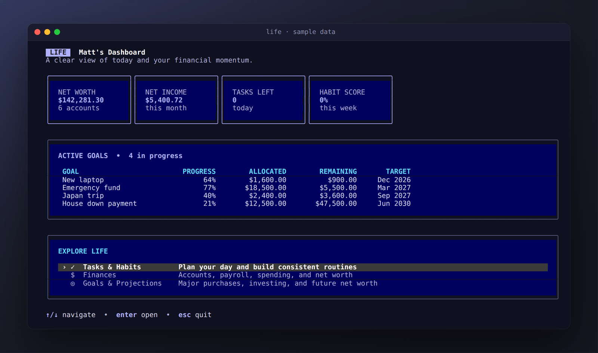
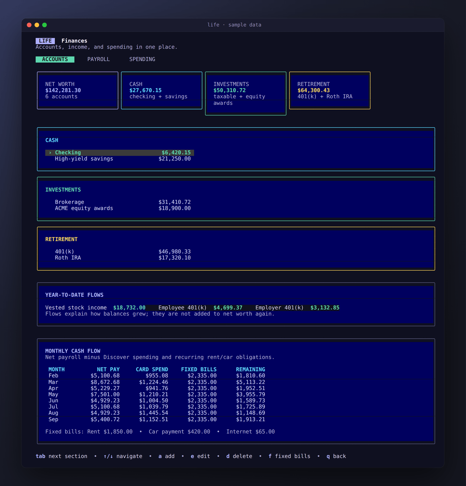
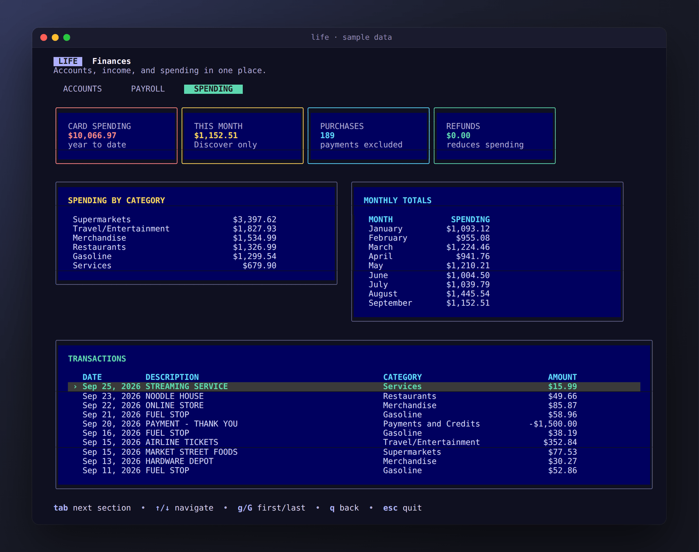
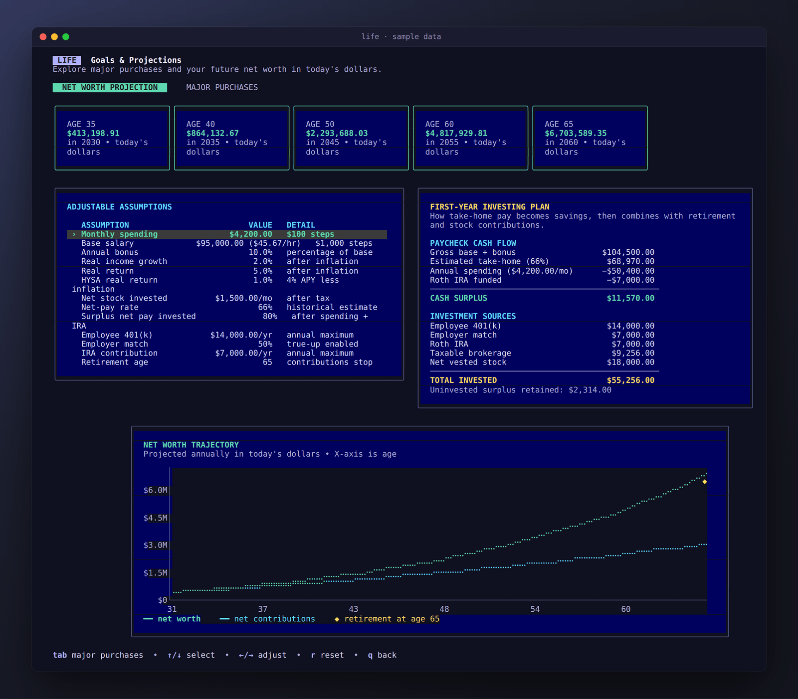
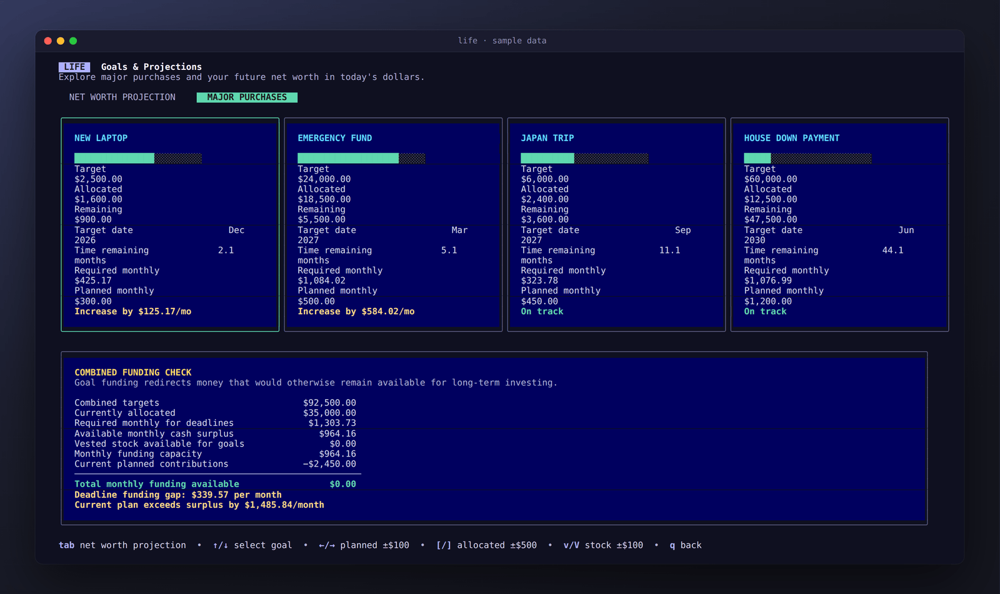

Life is a keyboard-driven dashboard for the questions I kept answering with
spreadsheets: *Where did this month's paycheck go? How much equity vested this
year? Am I on track for the things I'm saving for? What does all this add up to
in twenty years?*

It runs in the terminal, opens instantly, and keeps everything in one local
SQLite database on your own machine. There's no account, no server and no sync.
Pay statements and card exports are parsed locally, and only the numbers you
approve are saved.

_All screenshots use made-up sample data._

## The dashboard

The home screen answers "how am I doing?" at a glance: net worth across every
account, net income so far this month, today's tasks, and progress on each
savings goal. Everything else is one keypress away.

## Finances

The Finances section has three tabs (**Accounts**, **Payroll** and
**Spending**) and you move between them with `tab`.

### Accounts

Accounts are grouped into cash, investments and retirement, with a total for
each. Balances can be added and edited from the keyboard. Two panels explain
*why* the numbers moved:

- **Year-to-date flows** show vested stock, your 401(k) contributions and the
  employer match. They explain growth without being double-counted in net worth.
- **Monthly cash flow** takes net pay, subtracts card spending and fixed bills
  (rent, car, internet), and shows what's actually left each month.

### Payroll

The Payroll tab (shown at the top of this page) is built from imported pay
statements. It shows year-to-date gross, taxes, deductions and net pay; vested
equity and retirement contributions; and a scrollable list of every statement.

The **compensation mix** table lines up payroll by pay date with equity by vest
date, so months with a vest or a bonus stand out, and shows your take-home
percentage. Select any statement to break its month down into base pay,
overtime, bonuses, taxes, 401(k) and net cash.

### Spending

Card transactions come from a statement export and are grouped by category and
by month. Payments and credits are recognised and left out of spending totals,
and every transaction is listed underneath.

## Goals & projections

### Net worth projection

This is the part I use most. It projects net worth year by year, **in today's
dollars**, from assumptions you can change live with the arrow keys:

- salary and bonus, and real income growth,
- spending, and real returns on investments and on savings,
- how much of your net pay and vested stock gets invested,
- 401(k), employer match and IRA contributions, and your retirement age.

The **first-year investing plan** traces how take-home pay turns into savings:
what's left after spending and the IRA, and where each dollar gets invested.
The chart shows net worth against what you actually contributed, so you can see
how much of the growth comes from compounding. It's drawn with braille
characters, which gives it much finer resolution than ordinary text.

### Major purchases

Each savings goal has a target, a deadline, what's already set aside and a
monthly plan. Life works out the monthly amount each goal needs to hit its date
and flags the ones that are behind ("Increase by $125/mo").

The **combined funding check** then asks the harder question: can your monthly
surplus actually cover all of these goals at once, and how much long-term
investing does funding them give up?

## Tasks & habits

A simple daily task list and a weekly habit score, both reachable from the
dashboard. This part is still early; more detailed habit tracking is next.

## Importers, built to forget

- **Pay statements (PDF):** press `i` on the Payroll tab and paste the file
  path. Life parses the PDF locally, shows a preview and saves only what you
  confirm. It keeps the document number, dates and summary amounts, and
  discards names, addresses, employee IDs and bank details in memory.
  Re-importing a statement updates it instead of creating a duplicate.
- **Stock vesting history:** grants that vest on the same date are combined into
  one event, dividend reinvestments are skipped, and duplicates are ignored.
- **Card statements:** a small script imports a year-to-date statement into
  the Spending tab.

Your database, PDFs and exports are all excluded from Git, and a fresh install
starts empty with a short profile setup.

## How it's built

- **Go**, with [Bubble Tea](https://github.com/charmbracelet/bubbletea) for the
  app loop and [Lip Gloss](https://github.com/charmbracelet/lipgloss) for
  layout and colour. Every screen is plain text arranged into panels, cards and
  tables.
- **[ntcharts](https://github.com/NimbleMarkets/ntcharts)** for the braille
  line charts.
- **SQLite** via a pure-Go driver, so there's no C toolchain and cross-compiling
  just works. The schema migrates itself as new columns are added.
- **Releases:** pushing a version tag runs the test suite on GitHub Actions and
  publishes Windows, macOS (Intel and Apple silicon) and Linux binaries, so
  trying it is a single download.
