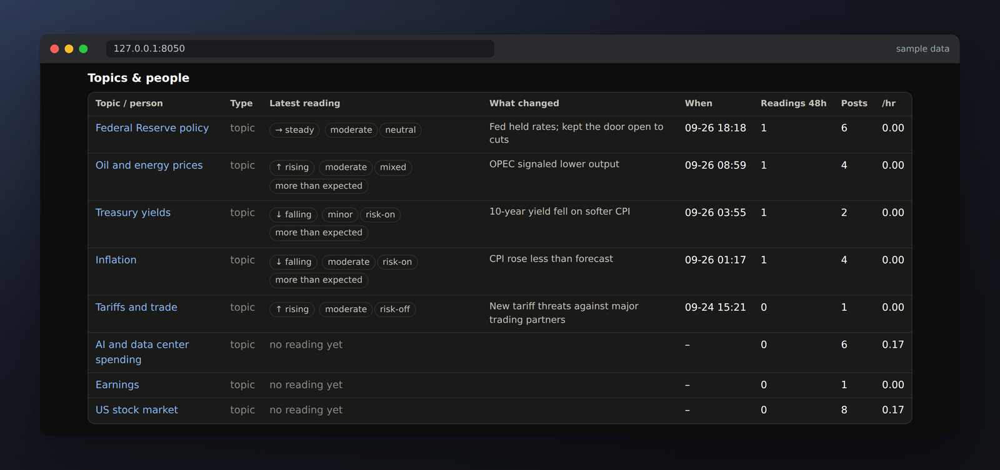
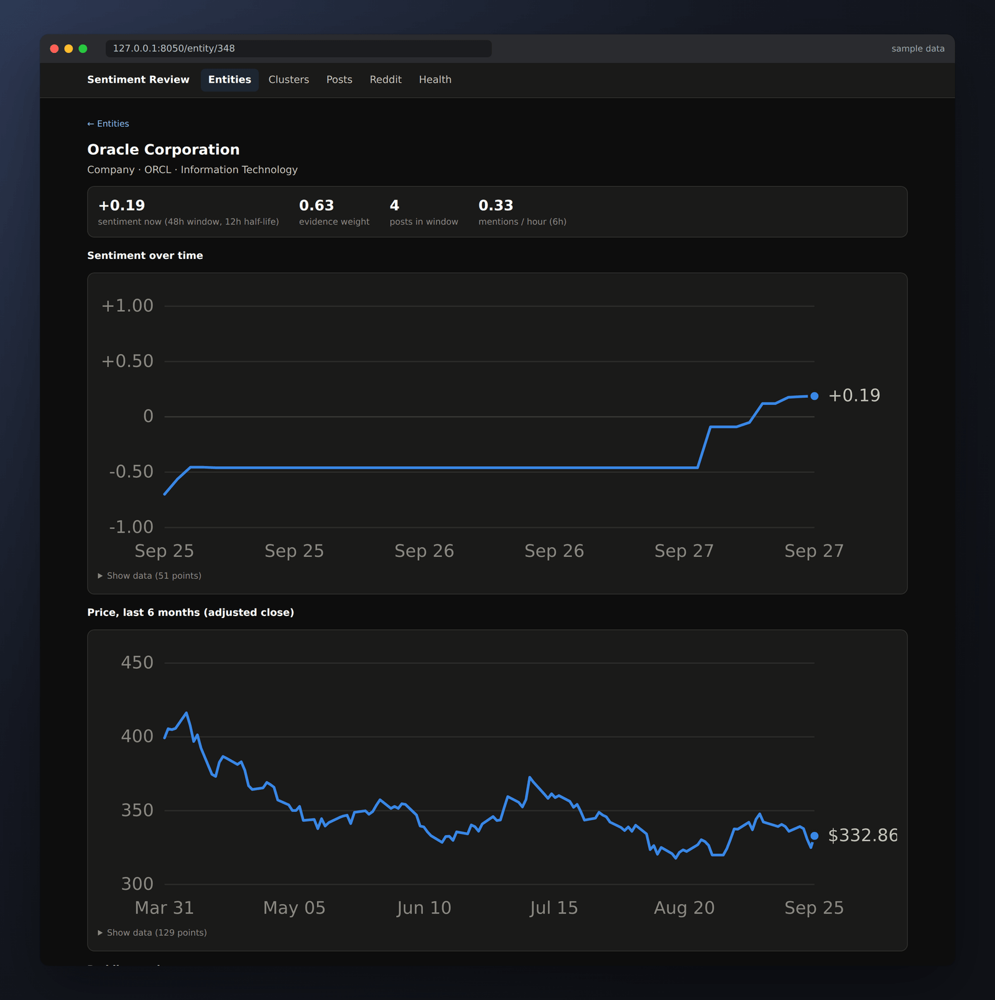
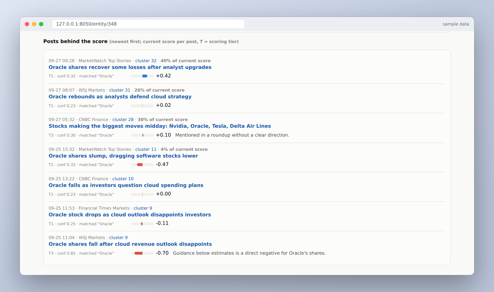
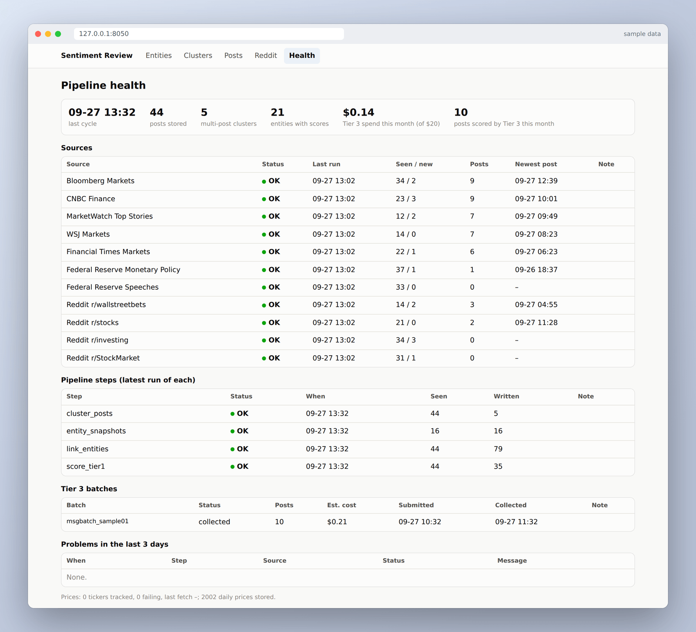

Sentiment Trader is a research tool that answers one question: *what is the
news saying about this company right now, and why?* It collects financial news,
works out which companies, people and topics each story is about, scores the
sentiment, and rolls it up into a signal for each stock, where every number can
be traced back to the articles behind it.

It's built to inform manual decisions, not to trade automatically. The source
is private for now.

_Screenshots show the real dashboard running the real pipeline on a small set
of made-up headlines, so the stories, scores and prices are sample data._

## The pipeline

A scheduled job runs a full cycle every 30 minutes. Each step is idempotent,
logs its own result, and can be run on its own:

1. **Ingest:** pull headlines and summaries from market news feeds and the
   Federal Reserve's policy and speech feeds.
2. **Social volume:** hourly ticker-mention counts from Reddit's stock
   communities, via ApeWisdom.
3. **Link entities:** work out which of 530+ entities each post mentions.
4. **Cluster:** group posts about the same event.
5. **Score:** Tier 1, then Tier 2, then Tier 3 for the posts that need judgment.
6. **Snapshot:** a rolling, time-decayed sentiment score for each entity.
7. **Prices:** daily closes for every ticker in the news.
8. **Back up:** a verified daily database dump.

## Knowing what a story is about

The entity index covers the S&P 500, the people who move markets (the Fed
Board, Treasury, the SEC…) and macro topics such as inflation, Treasury yields,
oil and AI spending. The linker gives every match a confidence:

| Match | Confidence |
| --- | --- |
| Ticker, like `$NVDA` or `(NASDAQ: NVDA)` | 0.95 |
| Company or person name ("Nvidia") | 0.90 |
| Topic keyword ("rate cut", "CPI") | 0.80 |
| Ambiguous name next to finance words ("Target shares fall") | 0.70 |
| Ambiguous name on its own ("Target") | 0.40 |

Names that are also ordinary words are the hard part. On its own, *Target*,
*Visa* or *Block* is only a weak match; finance words nearby ("shares",
"earnings") make it a confident one.

## Three tiers of scoring

| Tier | Scorer | Used for |
| --- | --- | --- |
| 1 | VADER plus a finance word list | every linked post: fast, but naive |
| 2 | FinBERT, run locally on the CPU | posts with a confident entity link |
| 3 | Claude, via the Message Batches API | posts that need interpretation |

Tier 1 and Tier 2 score the *tone* of a post and apply it to every company it
mentions. That breaks on stories like "oil jumps", which is good news for
producers and bad news for airlines. Tier 3 handles those.

A post goes to Tier 3 when it's covered by several outlets, mentions a person,
names more than one company, touches a macro topic, or leaves FinBERT unsure.
For each post, Claude returns:

- a likely **share-price impact** for each company, with a confidence and a
  one-line reason;
- a **reading** for each topic or person: what changed, which way, whether it
  was a surprise, how big, and whether markets read it as risk-on or risk-off;
- **other companies affected**, either named directly or inferred through a
  topic, guided by a small set of rules like "oil prices up → energy ↑,
  airlines ↓" that it may override, with a reason.

Topics aren't forced onto a single number. A reading like "yields ↓, risk-on,
more than expected" says far more than "+0.4".

Tier 3 runs on the Batches API at half price, with shared instructions cached
between calls. It works within a hard **$20 a month** budget: every call's
exact cost is logged, and each day gets an allowance based on what's left for
the month. Posts that don't fit wait their turn, highest priority first.

## Grouping stories

Posts about the same event are clustered in two stages. First, a post is only
compared with open clusters that share a confidently linked company, person or
topic. Then local sentence embeddings (all-MiniLM-L6-v2) decide whether it's the
same story. The thresholds are stricter when the only overlap is a broad topic,
and daily market roundups ("Stocks making the biggest moves…") are never merged
with each other.

## From posts to a signal

Every cycle, each company gets a rolling score over the last 48 hours:

- each post's weight = source credibility × its confidence × a **12-hour
  half-life** decay;
- the score is the weighted average direction, from −1 to +1;
- the snapshot also records **velocity** (mentions per hour) and the top five
  posts moving the score.

A score backed by two articles is an anecdote, not a trend, so the dashboard
always shows the **evidence weight** next to it.

## The review dashboard

A small Flask app that only reads the database. It can also export everything
as one self-contained HTML page for checking on a phone.

Each company page shows the score over time next to price and Reddit
attention…

…and exactly which posts produced it, with each post's tier, confidence, share
of the score and, for Tier 3, the reasoning. In this sample, VADER rates
"Oracle falls as investors question cloud spending plans" as neutral (+0.00),
while Tier 3 calls the guidance miss clearly negative (−0.70). That gap is
exactly why the tiers exist.

The health page shows at a glance whether any feed, step or batch is failing.

## Engineering notes

- **PostgreSQL** in Docker, with numbered SQL migrations. Raw posts are an
  **append-only audit trail enforced by database triggers**: updates, deletes
  and truncates are rejected.
- **Failures are visible, not silent.** Every step writes a run record, and a
  feed that returns zero entries or goes quiet is flagged. Before a feed is
  added, its article IDs are checked for stability across fetches; feeds whose
  IDs could change when a headline is edited were left out.
- **Nightly backups are verified** by reading each dump back before keeping it,
  and a full restore has been tested against live row counts.
- **Models run offline** once downloaded. FinBERT and the embedding model are
  pinned to exact versions, so scores and thresholds stay reproducible.
- **An offline test suite** covers feed parsing, entity linking, clustering,
  scoring and snapshots.

## What I learned

- Word-list sentiment is fast and cheap, but it can't tell *who* a story is
  good for. The tiered design came from watching it apply "Ellison pledges
  Oracle shares" to three different companies.
- Most of the work is data plumbing: stable IDs, duplicates, paywalled feeds
  that only publish headlines, and deciding what "about this company" means.
- Making every number traceable back to its articles turned out to be the most
  useful feature. It's what makes the signal something I can trust (or argue
  with).
